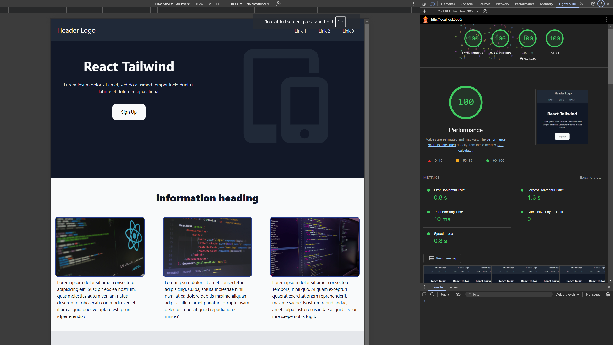

# Landing Page

This repository contains a template landing page site built using React and Tailwind CSS. It provides a starting point for creating beautiful and responsive landing pages.

## Getting Started

To get started with the project, follow these steps:

1. Clone the repository
2. Install the dependencies: `npm install`
3. Start the development server: `npm start`

The above command will run the app in development mode. Open [http://localhost:3000](http://localhost:3000) to view it in your browser. The page will automatically reload when you make changes.

## Building for Production

To build the app for production, use the following command `npm run build`

This command will create a production-ready build of the app in the `build` folder. The build is optimized for performance and the filenames include hashes for cache busting.

## Deployment

To deploy the app, you can use the following command `npm run deploy`

This command will deploy the app to the GitHub Pages. You can customize the deployment configuration in the `package.json` file.

## Learn More

To learn more about React, check out the [React documentation](https://reactjs.org/).

To learn more about Tailwind CSS, check out the [Tailwind CSS documentation](https://tailwindcss.com/).

## License

This project is licensed under the MIT License. See the [LICENSE](LICENSE) file for details.

## Preview

