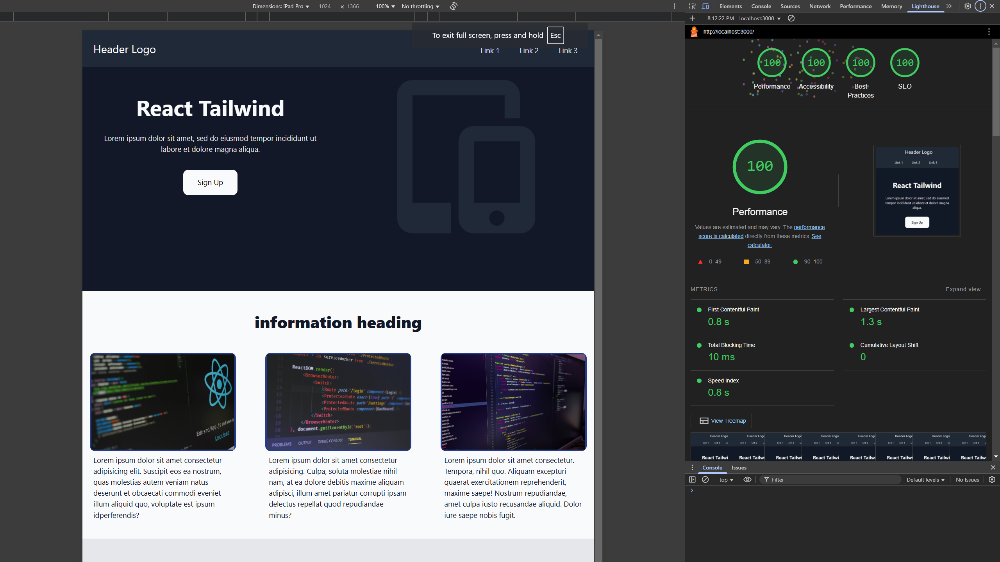

# Landing Page

A template landing page built with React 19, TypeScript, Tailwind CSS 4, and Vite. Designed as a starting point for responsive, production-ready landing pages.

## Stack

| Tool         | Version | Purpose                      |
| ------------ | ------- | ---------------------------- |
| React        | 19      | UI framework                 |
| TypeScript   | 6       | Type safety                  |
| Tailwind CSS | 4       | Utility-first styling        |
| Vite         | 8       | Build tooling and dev server |

## Prerequisites

- Node.js >= 24

## Getting Started

```bash
git clone https://github.com/milliorn/landing-page.git
cd landing-page
npm install
npm start
```

The dev server starts at `http://localhost:5173/landing-page/`.

## Scripts

| Command           | Description                            |
| ----------------- | -------------------------------------- |
| `npm start`       | Start the Vite dev server              |
| `npm run build`   | Build for production (output: `dist/`) |
| `npm run preview` | Preview the production build locally   |
| `npm run deploy`  | Deploy to GitHub Pages                 |

## Deployment

The app is deployed to GitHub Pages via the `gh-pages` package. The `predeploy` script runs `build` automatically before deploying.

```bash
npm run deploy
```

Live site: [https://milliorn.github.io/landing-page](https://milliorn.github.io/landing-page)

## References

- [React](https://react.dev/)
- [TypeScript](https://www.typescriptlang.org/)
- [Tailwind CSS](https://tailwindcss.com/)
- [Vite](https://vite.dev/)

## License

MIT — see [LICENSE](LICENSE) for details.

## Preview


